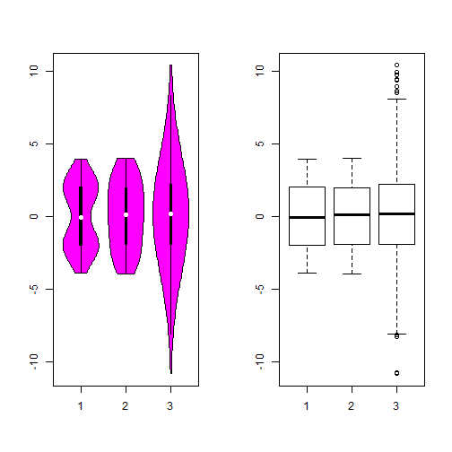

# Plotting for Analysis

In this assignment we will use the Iris data set. This is a Iris flower data set originally used by the Ronald Fisher in his works. This multivariate dataset is now widely used to teach and test statistical learning tools, like classifiers. It lists the length and width of sepal and petal of three types of Iris flowers (Iris setosa, Iris virginica and Iris versicolor). All the measurments are in cm.

This data set is avilable by deafult with R. We created a CSV file for the same. Use this CSV file. Use Pandas library to read the CSV file and create a data frame. You can also get the same dataset from Scikit-learn (Sklearn) library:
```
import pandas as pd
from sklearn import datasets

# Get the data
iris = datasets.load_iris()
# convert to pandas data frame
iris_df = pd.DataFrame(data=iris.data, columns=iris.feature_names)
```
You can use the head() method of Pandas data frame to see the top part of the data.

## Task
For the following tasks, create JupyterLab notebook. Name the file as your_roll_number_class_7_assign_2.ipynb. Submit this along with the previous notbook file.
1. Read the iris flower data.
2. Create a box plot showing Sepal Length, Sepal Width, Petal Length, Petal Width of all the Iris flowers.
3. Show the same data as a violin plot.
4. Compare these two plots and comment on the diferences you have noticed from these two respresentations of the same data. 


### Background on box plot and violin plot
Suppose we have three variables, A, B and C. We made 200 measurments for each of these variables. To visualise the data we can create a Bar plot. In this plot we will draw vertical bars representing the mean value for each variable. We will add a whisker on the bar to represent the standard deviation of the data.
<br>
Though bar plots are very common, they hide lots of information. First of all they only show the mean and variance. They do not explicitely show the spread of the data.
<br><br>
To solve this problem, it is wiser to use a Box plot, particularly when you have a large data set.
<br><br>
A box plot, also known as a box and whisker plot, is a graphical representation of a dataset that displays the distribution of the data based on five summary statistics: the minimum value, the first quartile (Q1), the median, the third quartile (Q3), and the maximum value.
<br>
The box plot consists of a box and two "whiskers". The box represents the interquartile range (IQR), which is the range between the first quartile (Q1) and the third quartile (Q3) of the data. The line inside the box represents the median of the data. The whiskers extend from the box to the minimum and maximum values, excluding outliers. Outliers are data points that fall outside the whiskers and are plotted as individual points.
<br><br>
A violin plot is a type of data visualization that displays the distribution of a dataset. It is similar to a box plot, but instead of using a box and whiskers to represent the data, it uses a kernel density plot and a box plot together.
<br>
A violin plot consists of a set of vertical "violins", one for each category or group in the dataset. The shape of each violin represents the kernel density estimate of the data in that category or group. The wider parts of the violin represent areas of higher density, while the narrow parts represent areas of lower density. 
<br>
We can also show the mean, median and extremums of the data over a violin plot.
<br>

<br>
Figure [reference](http://yufree.github.io/blog/2013/08/15/boxplot-vs-violinplot.html)
