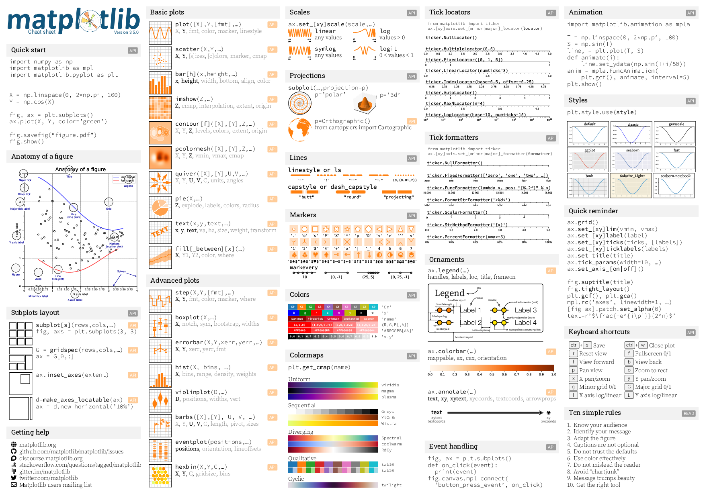

# Going beyond

We have only touched the tip of plotting in python. There are several exciting things in the Plotting/Visualization landscape. Depending upon what you are plotting and how elegantly you wish to present it, you caan have several options to choose from.
* The most popular Python library is Matplotlib. You might get amazed on seeing the diversity of plotting methods [here](https://matplotlib.org/cheatsheets/).
* Two other popular libraries are Plotly and Seaborn. Plotly is used for creating interactive visualizations that can be embedded in web applications.
* Seaborn is built on top of Matplotlib and provides more advanced features for creating complex visualizations.
* Tip: first think and draw a rough sketch of how you wish the plot to appear. Then very likely, some amount of searching on internet will help you how to do it. Remeber: Python is an open-source community - we grow by sharing.
